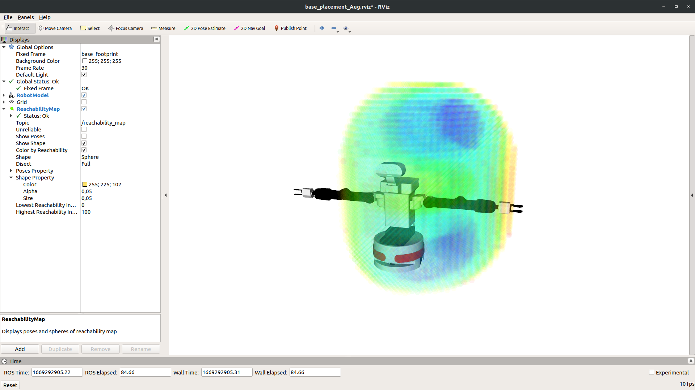

# Reachability map visualizer

<p float="left">
  
  
</p>

**ROS** package for visualizing a robot's reachability and base placement maps

- Currently supports ROS melodic and Ubuntu 18 (although porting to ROS noetic and Ubuntu 20 should not be difficult).

- To generate the reachability maps, have a look at the [sampled_reachability_maps](https://github.com/iROSA-lab/sampled_reachability_maps) ([github.com/iROSA-lab/sampled_reachability_maps](https://github.com/iROSA-lab/sampled_reachability_maps)) repository.

- This repository is a part of the codebase of the paper: **Robot Learning of Mobile Manipulation With Reachability Behavior Priors** [1] [[Paper](https://arxiv.org/abs/2203.04051)] [[Project site](https://irosalab.com/rlmmbp/)]

- The code is based on the *workspace_visualization* package of the *reuleaux* repository ([github.com/ros-industrial-consortium/reuleaux](https://github.com/ros-industrial-consortium/reuleaux)). Please refer to [wiki.ros.org/reuleaux](http://wiki.ros.org/reuleaux) for more information.

## Loading a map and running the visualization

- Build this package in your ROS workspace and source the `devel/setup.bash` file
- Load the reachability/base_placement map by running (for example)
  ```
  rosrun reachability_map_visualizer load_reachability_map $(rospack find reachability_map_visualizer)/maps/3D_reachability_map_arm_left_tool_link_0.05_2022.h5
  ```
- Run `rviz` and in the 'Displays' panel click on 'Add'. Choose 'By display type' and select the **ReachabilityMap** option under the 'reachability_map_visualizer' folder. To run our example rviz config, use:
  ```
  rosrun rviz rviz -d $(rospack find reachability_map_visualizer)/rviz/reachability_map.rviz
  ```
  
- You can play with the visualization settings in Rviz:

  
- The voxel coloring scheme can be changed by editing the "ReachMapVisual::setColorSpherebyRI" function in the "reachability_map_visual "file. By default, dark blue denotes the highest reachability while red denotes the lowest.

## References
[1] S. Jauhri, J. Peters and G. Chalvatzaki, "Robot Learning of Mobile Manipulation With Reachability Behavior Priors", https://doi.org/10.1109/LRA.2022.3188109